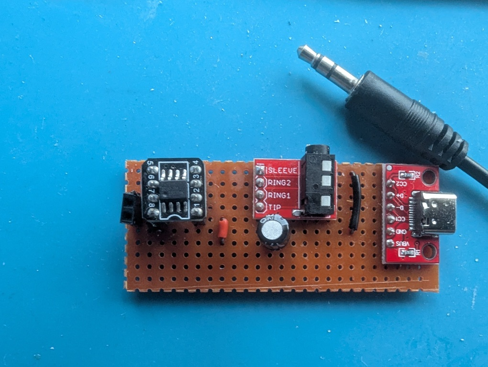

# Minimal CW practice oscillator and trainer

I needed something with a minimal amount of fuss and controls to do a
couple of things.

1. Get onto [LICW](https://longislandcwclub.org/) Zoom classes to send
   code via a straight key.

1. Have something play characters to echo back for sending practice,
   and grade for timing issues and change difficulty automatically.

1. Code golf with a tiny MCU to see what little is needed and get away with.

A short demo of how it works.

The hardware is uncomplicated, I just solder connectors into a stripboard.

